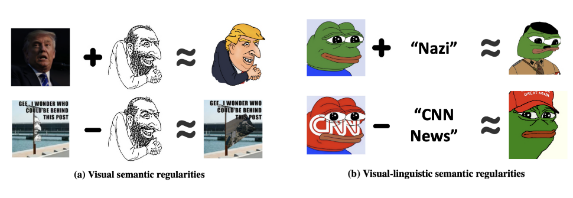

# On the Evolution of (Hateful) Memes by Means of Multimodal Contrastive Learning

This repository is a pytorch implementation of this paper (see https://arxiv.org/abs/2212.06573) accepted by IEEE S&P 2023.



Overall, this code conducts a series of multimodal analyses to understand (hateful) memes and the evolution process. First, we obtain
multimodal meme representations, i.e., CLIP embeddings, and perform DBSCAN clustering to form meme clusters. We then conduct automatic annotation and hate assessment based on the clusters. Most importantly, this code provides a framework for identifying hateful meme variants and potential influencers. Given given a popular hateful meme and the 4chan dataset, we automatically retrieve variants by extracting visual and visual-linguistic semantic regularities.


## Requirements
```
pip install -r requirements.txt
```
## Running the Pipeline

Now we describe the running pipeline with a set of test data.

### Obtain CLIP Embeddings

To get all image and text embeddings:
```
python inference.py --data_file data/4chan.txt \
                    --model_file the/finetuned/model/path \
                    --save_dir data
```
To get non-duplicated image embeddings only:
```
python inference.py --data_file data/4chan_images_only.txt \
                    --model_file the/finetuned/model/path \
                    --save_dir data
```
- The input `4chan.txt` is a long list of dicts with image location, comment, and the posted time as keys. [CLIP (https://github.com/openai/CLIP) will compute both text and image embeddings and save into a npz file sequentially. The finetuned
CLIP model can be downloaded [here](). By changing `4chan.txt` to `4chan_images_only.txt`, We can compute non-duplicated image embeddings only to improve computing efficiency later. `4chan_images_only.txt` is also a long list of dicts with image location and its phash as keys. 
- Output: Image-text or image embeddings saved as `embeddings.npz` or `image_embeddings.npy`.

### Understanding Hateful Meme Clusters

To cluster, annotate, and assess hate:
```
python cluster.py --data_file data/4chan.txt \
                  --embeddings_dir data/embeddings.npz \
                  --perspective_dir data/perspective.txt \
                  --rewire_dir data/rewire.txt \
                  --eps 3 \
                  --min_samples 5 \
                  --save_dir result/multimodal_clusters
```
- The input `--embeddings_dir` requires a npz file of both image and text embeddings obtained previously. `--perspective_dir` and `--rewire_dir` is text toxicity scores obtained with [Google Perspective API](https://perspectiveapi.com/) and [Rewire API](https://rewire.online/). `--eps` and `--min_samples` are DBSCAN parameters that we determine with subsets of 4chan data. 
- Output: cluster annotations (.xlsx), cluster graph (.gexf), tsne projection (.pdf)

### Hateful Memes Evolution


#### A. Visual Semantic Regularity
```
python extract_visual_regularities.py --meme HappyMerchant \
                                      --image_dict data/4chan_images_only.txt \
                                      --image_embeddings data/image_embeddings.npy \
                                      --image_root data/images \
                                      --lower 0.85 \
                                      --higher 0.91 \
                                      --influencer_lower 0.91 \
                                      --final_thred 0.94 \
                                      --save_dir result/visual_regularity
```
- This script first identifies the meme variants given a hateful meme. Then, for each variant, it further automatically estimates the possible influencers. We use two popular hateful memes as case studies. Type `HappyMerchant` or `PepeTheFrog` for the input `--meme`. `--lower`, `--higher`, `--influencer_lower`, and `--final_thred` are four thresholds that needs to be manually determined and evaluated. We provide the detailed explaination and the default thresholds in the script. 
- Output: variant-influencer pairs (.npz), a graph with memes as nodes and pairing relation as edges (.gexf), visualization of variant-influencer pairs in top-20 communities (.png)

#### B. Visual-linguistic Semantic Regularity
```
python extract_visual_linguistic_regularities.py --meme HappyMerchant \
                                                 --entity_dir data/entities \
                                                 --data_file data/4chan.txt \
                                                 --image_dict data/4chan_images_only.txt \
                                                 --image_embeddings data/image_embeddings.npy \
                                                 --image_root data/images \
                                                 --save_dir result/visual_linguistic_regularity
```
- This script retrieves meme variants given a hateful meme and a list of entities and further conducts temporal analysis. `--entity_dir` is the directory of four types (People, GPE, NORP, ORG) of extracted entities.
- Output: variant-entity pairs (.npz), variant occurrence (.csv), popular variants (in top-2 variants) (.png)

## Dataset

TODO

## Manual Annotation

TODO

## Reference

If you use or find this source code or dataset useful please cite the
following work:
```
@inproceedings{QHPBZZ23,
author = {Yiting Qu and Xinlei He and Shannon Pierson and Michael Backes and Yang Zhang and Savvas Zannettou},
title = {{On the Evolution of (Hateful) Memes by Means of Multimodal Contrastive Learning}},
booktitle = {{IEEE Symposium on Security and Privacy (S\&P)}},
publisher = {IEEE},
year = {2023}
}
```
## Acknowledgments

- This project is partially funded by the Helmholtz Association within the project "Trustworthy Federated Data Analytics" (TFDA (funding number ZT-IOO1 4).
- We also gratefully acknowledge the support of Google (Perspective API) and Rewire for our experiments.
